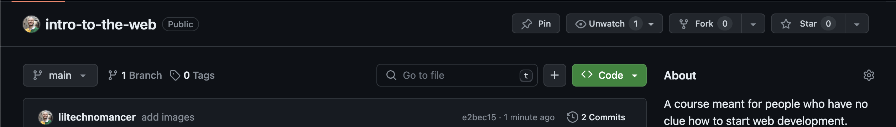
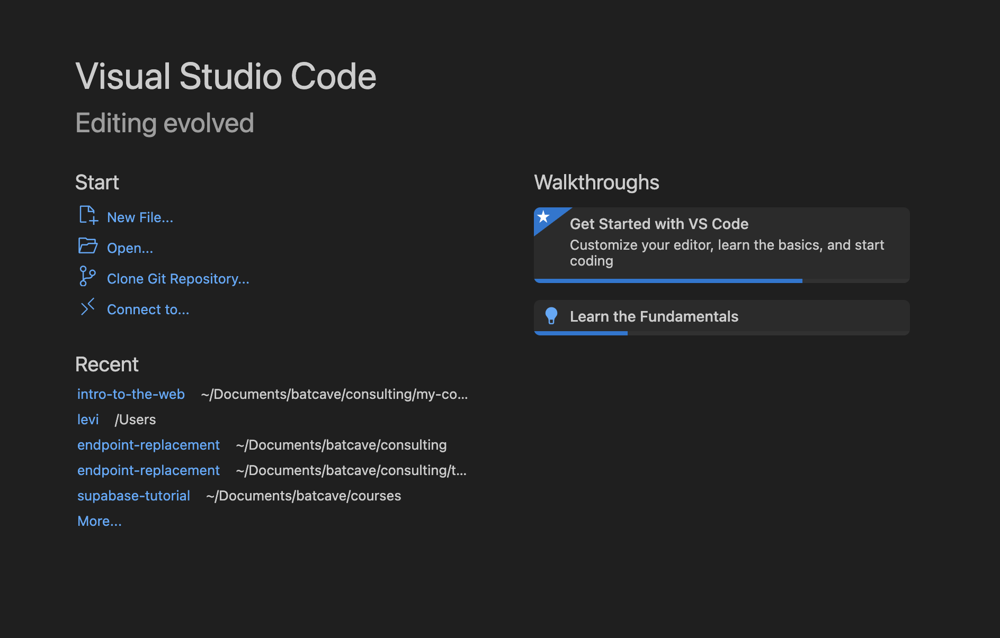
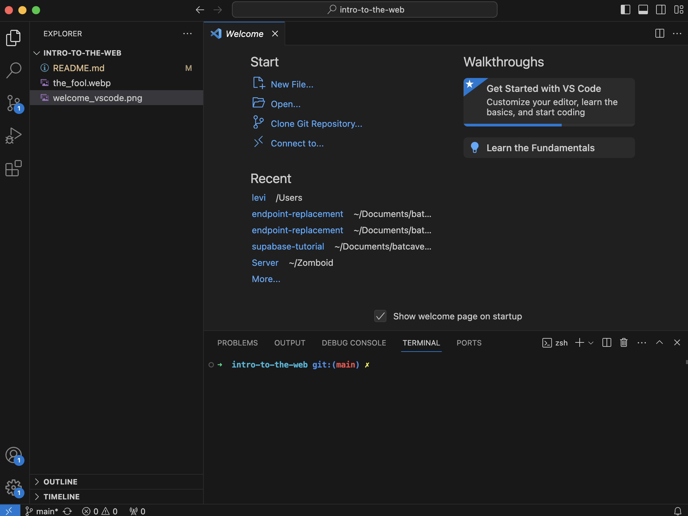
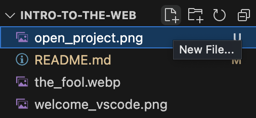
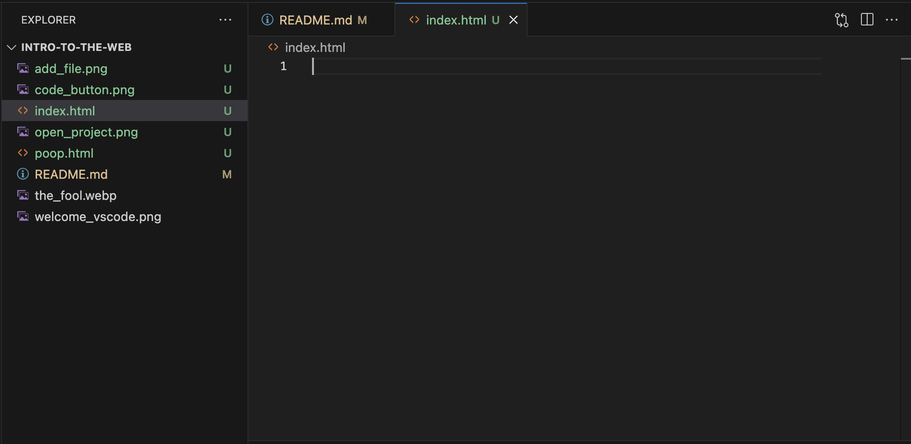
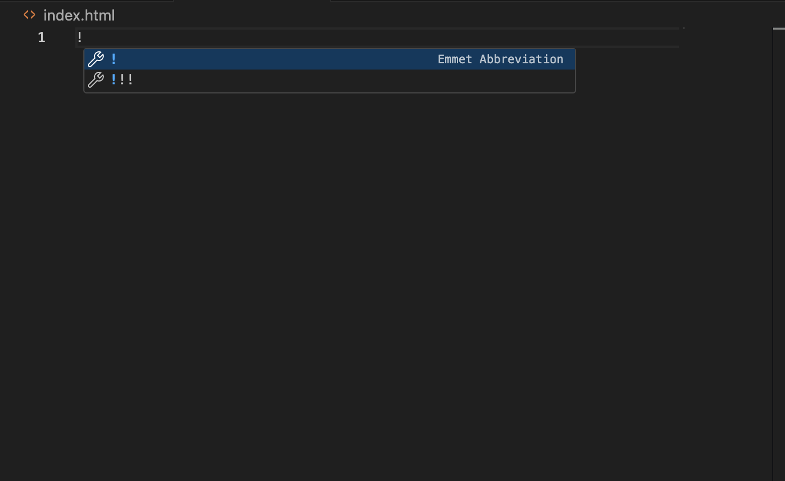
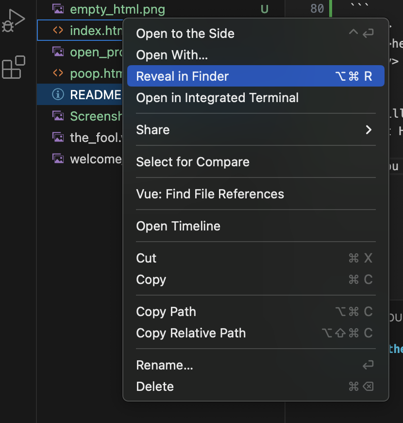

# Intro to Web Development.

This course is part of a series you can find [here](https://www.technomancy.dev/teach-yourself). The goal of the course is to bring complete beginners to a point where they could make a website for a small business, family, or a friend. 

## The fools journey. 

You are at the very beginning stages of a long and perilous journey. Make sure to get into the right headspace to take on a new and difficult task. 


### Humble beginnings. 

This tutorial is meant to equip you with the bare essentials for learning web development. When you complete it you should know what HTML, CSS, and JavaScript are and have a rough idea about how to write a few lines of each. 

It will serve as a jumping off point for future tutorials, where you will explore these concepts in much more detail. 



For now begin by clicking the "Code" button on this web page and clicking "Download ZIP" Then unpackage and move that zip file to the folder you want to keep this project in. 

If you are unsure of how to unpack a zip file google `how to unpack a zip file ${OPERATING_SYSTEM}` but replace `${OPERATING_SYSTEM}` with mac or windows or whatever you use. 

Awesome. Now you have the project on your computer. This will come in handy soon, but for now it might have seemed like a complicated way to get an empty folder. For now, just trust in the process. It will all reveal itself in time. 

Now we need the tool we use to actually write code for the web. You could use literally any text editor. Like "notes" from Apple. This would be a Really-bad-idea™ and we won't be entertaining that. 

Instead you will download what is considered the industy standard, and thankfully it is free. 

### Getting Started

Visit [this page](https://code.visualstudio.com/download) to download Visual Studio Code, and just do what they say and follow any prompts and stuff. There will be many times your experience will differ because of the machine you are on, and instead of trying to keep all that information up to date I will defer to the documentation for the thing were working on. You will need to build the skill of reading these docs anyway. 

Once you have VSCode, you can open it and will see a screen like this.



Click open and navigate to the folder you downloaded earlier. 

You should end up with something like this. 




### Intro to HTML

Create a new file by hovering the project name in the side bar and clicking the plus button over a little file. 



Name this file `index.html`, you should end up with something like this. 



Type just a `!` into this file which should prompt the editor to want to complete something for you. 



Hit enter and your editor should poop out a bunch of HTML. Ignore all this for now, you need it but it is not important to try and understand at this moment. 

For now just focus on the `<body></body>` part. 

This is called a tag, specifically this is the body tag. 


This is where we will start working, because in the `body` tag is where everything you see on a website goes. 

We will start by writing a "Hello World" in HTML

> A "hello world" is a common program meant to demonstrate the simplest task possible in a programming language. 

A hello world in html would be using a `heading` tag to display some text. 

There are six heading tags, so they are numbered. We will use the `h1` tag. 

`<h1>Hello dorks</h1>`

We need to add this inside the body tag. 

```
<body>
  <h1>hello dorks</h1>
</body>
```

You will notice we indented it one level. This is how you format HTML to show `h1` is a `child` of `body`

Now you can open this file in the browser, on mac you can do this by right clicking the file, clicking reveal in Finder, and then double clicking it. Other operating systems (like windows) should have a similiar option. 



After that your computer should open a browser window in your default browser to your file. It should look like this. 

Congratulations, you just completed the first of many "Hello Worlds" you will encounter on this journey. Go have a drink, you earned it. 

Next we will learn about CSS. 


